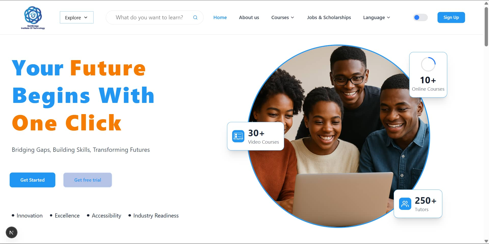
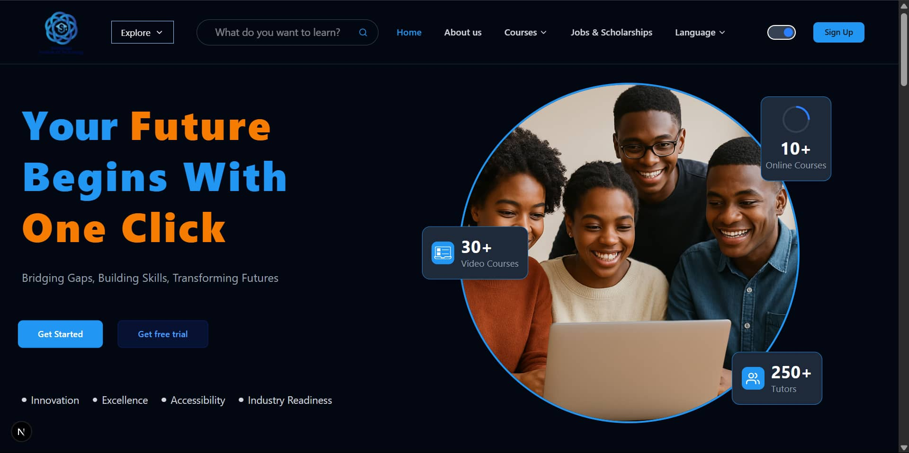
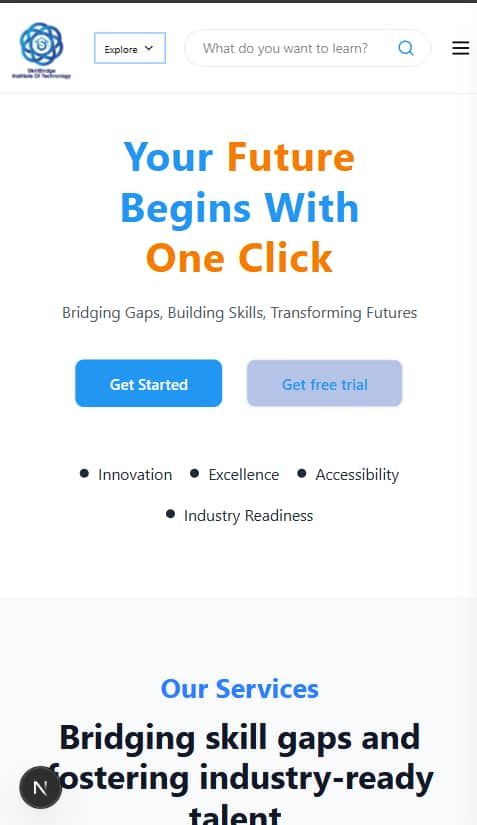
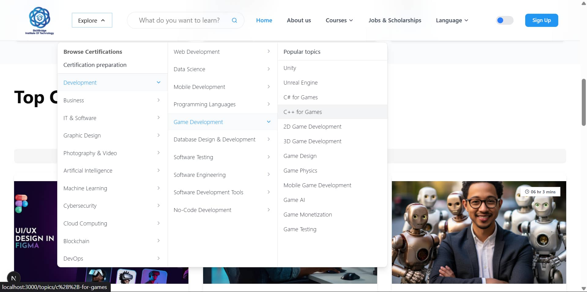

# Skillbridge Learning — Landing Page

<div align="center">
  
  
  <p align="center">
    A modern, responsive education platform landing page built with Next.js, TypeScript, and Tailwind CSS
    <br />
    <a href="#live-demo"><strong>View Demo »</strong></a>
    <br />
    <br />
    <a href="#getting-started">Getting Started</a> ·
    <a href="#features">Features</a> ·
    <a href="#file-structure">File Structure</a> ·
    <a href="#development-guide">Development Guide</a>
  </p>
</div>

## 📋 Table of Contents

- [Skillbridge Learning — Landing Page](#skillbridge-learning--landing-page)
  - [📋 Table of Contents](#-table-of-contents)
  - [📖 Overview](#-overview)
  - [📸 Screenshots](#-screenshots)
  - [🚀 Features](#-features)
    - [User Interface](#user-interface)
    - [Navigation \& Structure](#navigation--structure)
    - [Content Sections](#content-sections)
  - [🛠️ Technologies Used](#️-technologies-used)
    - [Core Technologies](#core-technologies)
    - [UI Components \& Styling](#ui-components--styling)
    - [Fonts \& Typography](#fonts--typography)
    - [Dev Tools](#dev-tools)
  - [📁 File Structure](#-file-structure)
  - [🚀 Getting Started](#-getting-started)
    - [Prerequisites](#prerequisites)
    - [Installation](#installation)
  - [🧪 Adding New Features](#-adding-new-features)
    - [Adding a New Courses](#adding-a-new-courses)
    - [Adding a New Components](#adding-a-new-components)
  - [📞 Contact](#-contact)

## 📖 Overview

SkillBridge is a feature-rich, responsive landing page for an educational platform, designed to showcase courses, instructors, and educational services. Built with modern web technologies like Next.js, TypeScript, and Tailwind CSS, it features a component-based architecture, theme switching capabilities, and optimized performance.

## 📸 Screenshots

<div align="center">
  <details>
    <summary><strong>Click to see all screenshots</strong></summary>
    <h3>Home Page - Light Mode</h3>
    
    <h3>Home Page - Dark Mode</h3>
    
    <h3>Mobile View</h3>
    
    <h3>Course Section</h3>
    
    <h3>Dropdown Menus</h3>
    
  </details>
</div>

## 🚀 Features

### User Interface
- **Responsive Design**: Fully responsive layout optimized for all devices (mobile, tablet, desktop)
- **Dark/Light Mode**: Theme toggle with system preference detection and localStorage persistence
- **Modern Animations**: Smooth animations and transitions using Framer Motion
- **Interactive Elements**: Tooltips, hover cards, tabs, and dropdown menus

### Navigation & Structure
- **Navbar with Dropdowns**: Multi-level navigation with dropdown menus
- **Mobile Menu**: Hamburger menu for mobile with slide-in animation
- **Section Organization**: Modular section-based layout

### Content Sections
- **Hero Section**: Eye-catching hero with animated stats and responsive text
- **Courses Section**: Filterable course cards with categorization
- **Instructors Section**: Instructor profiles with hover details and social links
- **Testimonials Section**: Testimonial carousel with user feedback
- **Success Section**: Animated counters for key metrics
- **Services Section**: Service offering cards with icons
- **Footer**: Multi-column footer with newsletter subscription

## 🛠️ Technologies Used

### Core Technologies
- [Next.js 14](https://nextjs.org/) - React framework for production
- [React 18](https://reactjs.org/) - JavaScript library for user interfaces
- [TypeScript](https://www.typescriptlang.org/) - Typed JavaScript
- [Tailwind CSS](https://tailwindcss.com/) - Utility-first CSS framework

### UI Components & Styling
- [shadcn/ui](https://ui.shadcn.com/) - Unstyled UI components
- [Framer Motion](https://www.framer.com/motion/) - Animation library
- [Lucide Icons](https://lucide.dev/) - SVG icon library
- [Tailwind CSS Animation](https://github.com/jamiebuilds/tailwindcss-animate) - Animation utilities

### Fonts & Typography
- [Next/Font](https://nextjs.org/docs/basic-features/font-optimization) - Font optimization
- [Montserrat](https://fonts.google.com/specimen/Montserrat) - Primary font

### Dev Tools
- [ESLint](https://eslint.org/) - Code linting
- [Prettier](https://prettier.io/) - Code formatting
- [TypeScript ESLint](https://typescript-eslint.io/) - TypeScript linting

## 📁 File Structure

```
education-landing-page/
├── app/                      # Next.js App Router
│   ├── layout.tsx            # Root layout with providers
│   ├── page.tsx              # Homepage
│   └── globals.css           # Global styles and Tailwind directives
├── components/               # UI Components
│   ├── ui/                   # shadcn/ui components
│   │   ├── shadcn-compoonents.tsx   # Reusable components
│   ├── courses-section.tsx   # Courses section component
│   ├── footer.tsx            # Footer component
│   ├── hero-section.tsx      # Hero section component
│   ├── instructors-section.tsx # Instructors section component
│   ├── navbar.tsx            # Navigation bar component
│   ├── services-section.tsx  # Services section component
│   ├── success-section.tsx   # Success metrics section component
│   ├── testimonials-section.tsx # Testimonials section component
│   ├── footer.tsx            # Footer component
│   └── theme-provider.tsx    # Theme provider for dark/light mode
├── data/                     # Data files
│   ├── courses.ts            # Courses data
│   ├── image-paths.ts        # Centralized image paths
│   ├── instructors.ts        # Instructors data
│   └── testimonials.ts       # Testimonials data and other data's append here
├── hooks/                    # Custom React hooks
├── lib/                      # Utility functions and helpers
│   └── utils.ts              # General utility functions
├── public/                   # Static assets
│   └── assets/
│       └── images/           # Image assets organized by section
│           ├── courses/      # Course images
│           ├── hero/         # Hero section images
│           ├── instructors/  # Instructor images
│           ├── placeholders/ # Placeholder images
│           ├── readme/       # README documentation images
│           └── testimonials/ # Testimonial images
├── types/                    # TypeScript type definitions
│   └── index.ts              # Shared type definitions
├── .eslintrc.json           # ESLint configuration
├── .gitignore               # Git ignore rules
├── next.config.mjs           # Next.js configuration
├── package.json             # Project dependencies and scripts
├── postcss.config.js        # PostCSS configuration for Tailwind
├── README.md                # Project documentation
├── tailwind.config.ts       # Tailwind CSS configuration
└── tsconfig.json            # TypeScript configuration
```

## 🚀 Getting Started

### Prerequisites

- Node.js 18.x or later
- npm or yarn or pnpm
- Git

### Installation

1. Clone the repository:
   ```bash
   git clone https://github.com/yourusername/education-landing-page.git
   cd education-landing-page
2. Install dependencies:
    ```bash
    npm install
    # or
    yarn install
    # or
    pnpm install
3. Run the development server:
   ```bash
    npm run dev
    # or
    yarn dev
    # or
    pnpm dev
4. Open http://localhost:3000 in your browse

## 🧪 Adding New Features

### Adding a New Courses

1. Add the course image to `public/assets/images/courses/`
2. Update `image-paths.ts` with the new image path
3. Add the course data to `courses.ts`

### Adding a New Components

1. Create a new file in the `components` directory
2. Follow the existing component structure and naming conventions
3. Import and use the component where needed

## 📞 Contact

For any questions or suggestions, please reach out to:

- Project Maintainer: [Your Name](mailto:your.email@example.com)
- Project Repository: [GitHub](https://github.com/your-username/education-platform)

---

Built with ❤️ by SkillBridge Team

  